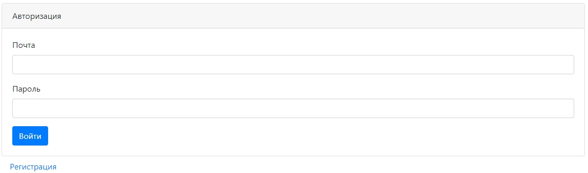
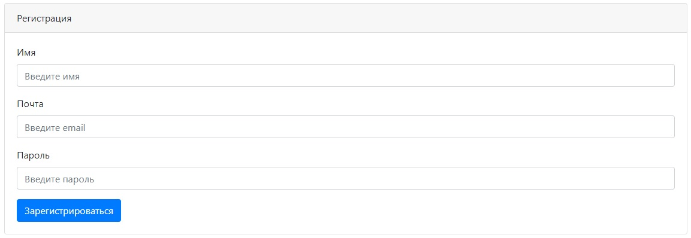
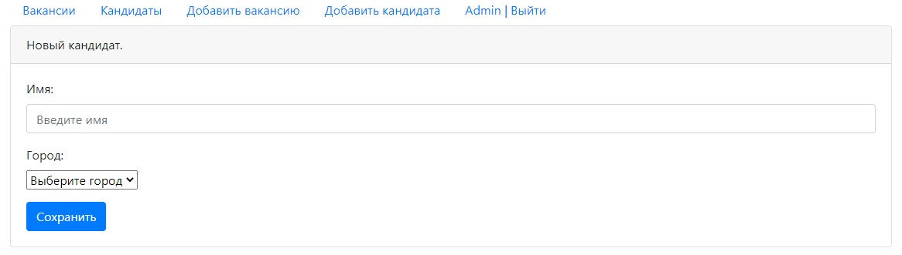
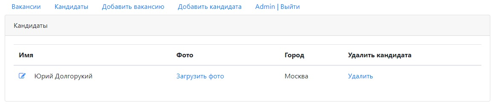

# Dream Job

**О проекте:**

Проект по изучению технологии Java EE.

**Используемые технологии:**

- Java 14
- Java Servlets, JSP
- HTML, JavaScript, jQuery
- Apache Tomcat
- PostgreSQL
- SLF4J with Log4
- Apache Maven

**Реализованные возможности:**

- Авторизация/регистрация пользователей
- Данные пользователей сохраняются в PostgreSQL
- Без регистрации с помощью фильтра ограничен доступ пользователей 
к некоторым разделам сайта
- Создание, редактирование, удаление информации о кандидатах и вакансиях
- Добавление фото для кандидата. Фото сохраняется на сервере.

